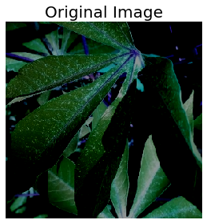
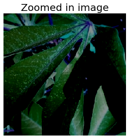
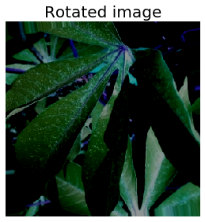
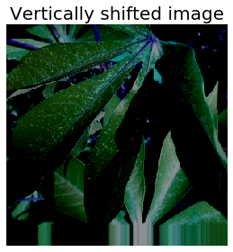
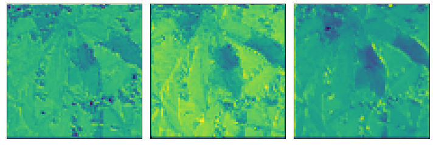
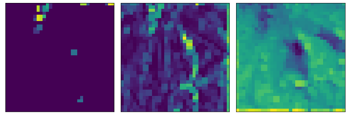

# Cassava desease classification

Cassava plant is an important source of food in the world. 
This plant is vulnerable to a number of viruses.

In this project, we fine tune the pretrained Inception V3 deep CNN trained on ImageNet 
to identify the type of disease that a given plant is infected with. 

## Data

The data used in this project are based on the [Cassava Fine-Grained Visual Categorization Challenge](https://arxiv.org/abs/1908.02900).

## Data Augmentation

We work with a dataset with a relatively small size. So during the training, we use image augmentation in order to 
help the model generelize better. This includes applying a set of transformation to the images during the batch training. These transformations include: shearing, flipping, shifting, etc. 





## Model

The core of the archituecture of our CNN model is the [Inception_V3](https://arxiv.org/abs/1512.00567) deep CNN model, which was trained on the [Imagnet data](www.image-net.org). We drop the last fully connected layers of Inception and replace them with a fully connect layer of 512 hidden units and lastly a softmax layer for the multi-lable classification task. 

## What does the CNN model see in an image?

In order to get an intuition of how the CNN work, we take a look at the activation maps.
The first convolutional layers capture the low level features such as the edges of objects while the last convolutional layers extract the more high level features.





## Model Performance

When we test the perforemance of the model with the unseen examples we achieve an overall accuracy of 83% which can be a bit misleading since the dataset is imbalanced. So we compute the precision, recall, and F1-score of the individual categories.
These metrics are listed in the table below:

             precision    recall  f1-score   support

         cbb       0.69      0.45      0.54       155
        cbsd       0.82      0.83      0.82       481
         cgm       0.80      0.72      0.76       258
         cmd       0.88      0.95      0.91       886
     healthy       0.72      0.72      0.72       105

    accuracy                           0.83      1885
    macro avg      0.78      0.73      0.75      1885
    weighted avg   0.83      0.83      0.83      1885

Note that the data set itself is highly imbalanced, with two of the classes, CMD & CBSD, dominating the examples. 
One could tackle the imbalanced nature of the data by using weights in the cost functions. Such weights will make the model pay more attention to the under-represented examples. In our work we have not used any weight which is evident in our model evaluation analysis in the code. 

## Reference

```
@misc{mwebaze2019icassava,
    title={iCassava 2019Fine-Grained Visual Categorization Challenge},
    author={Ernest Mwebaze and Timnit Gebru and Andrea Frome and Solomon Nsumba and Jeremy Tusubira},
    year={2019},
    eprint={1908.02900},
    archivePrefix={arXiv},
    primaryClass={cs.CV}
}
```

## Licence

[MIT](https://opensource.org/licenses/MIT)
